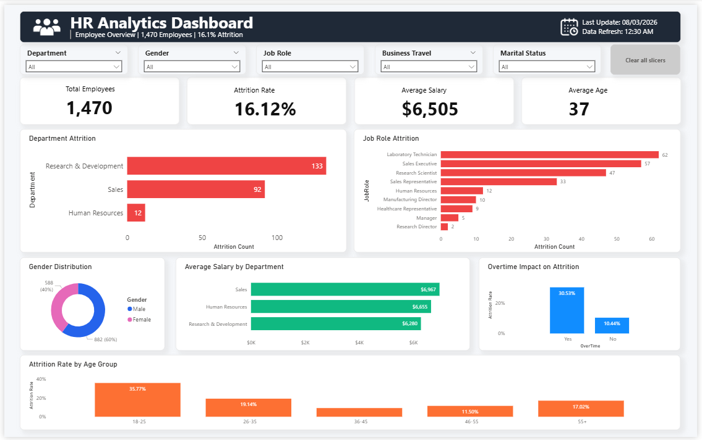
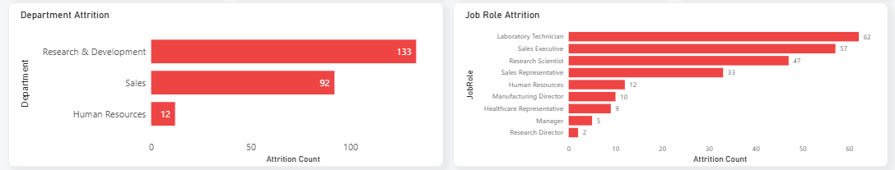
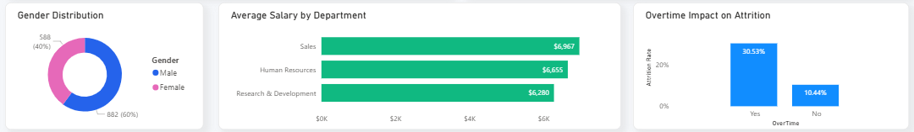
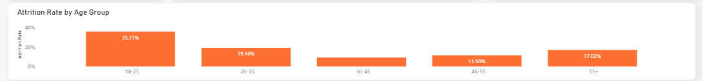
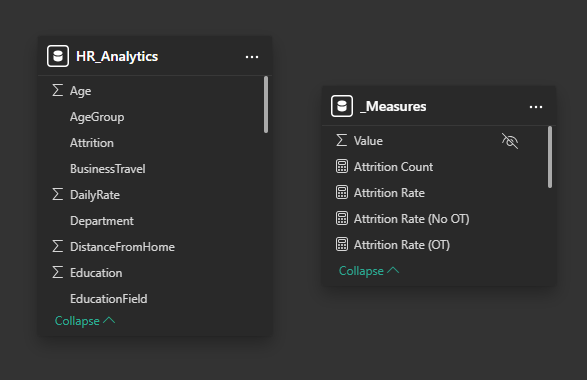

# 👥 HR Analytics Dashboard

An interactive **HR Analytics Dashboard** built with **Microsoft Power BI** to analyze workforce demographics, employee attrition, compensation, and overtime trends.

This project demonstrates data modeling, Power Query transformations, DAX calculations, and dashboard design following Power BI best practices.

---

# 📸 Dashboard Preview

Interactive HR Analytics Dashboard built using Microsoft Power BI.

### Department & Job Role Analysis

### Compensation & Workforce Analysis

### Age Group Analysis

---

# 📌 Project Overview

This interactive dashboard provides HR managers and business leaders with a comprehensive overview of workforce metrics, employee attrition, salary distribution, demographics, and overtime trends.

The dashboard helps decision-makers identify workforce patterns and understand the factors associated with employee turnover.

---

# 🎯 Business Objectives

This dashboard was developed to help HR professionals:

- Monitor overall workforce metrics
- Track employee attrition
- Identify departments with high turnover
- Analyze attrition by job role
- Compare salaries across departments
- Evaluate the impact of overtime on employee retention
- Understand workforce demographics

---

# 💡 Business Questions Answered

- 👥 How many employees are currently in the company?
- 📉 What is the overall attrition rate?
- 🏢 Which department experiences the highest attrition?
- 💼 Which job roles have the highest turnover?
- 💰 Which department has the highest average salary?
- ⏰ Does overtime contribute to employee attrition?
- 🎂 Which age group has the highest attrition rate?
- 🚻 What is the workforce gender distribution?

---

# ✨ Features

## Executive KPIs

- Total Employees
- Attrition Rate
- Average Salary
- Average Age

## Interactive Visualizations

- Department Attrition
- Job Role Attrition
- Gender Distribution
- Average Salary by Department
- Overtime Impact on Attrition
- Attrition Rate by Age Group

## Interactive Filters

- Department
- Gender
- Job Role
- Business Travel
- Marital Status

---

# 🏗 Data Model

The report follows a star-schema-inspired model.

### Tables

- HR_Analytics (Fact Table)
- _Measures (DAX Measures)

Data model:

---

# 🧮 DAX Measures

The dashboard includes custom DAX measures such as:

- Total Employees
- Attrition Count
- Attrition Rate
- Average Salary
- Average Age
- Employee Count
- Average Years at Company

Complete formulas are available here:

📄 [Documentation/dax-measures.md](Documentation/dax-measures.md)

---

# ⚙ Power Query Transformations

Data preparation includes:

- Data type validation
- Missing value checks
- Column formatting
- Data quality verification
- Model optimization

---

# 🎨 Dashboard Design

Design principles used:

- Executive-style dashboard layout
- Microsoft Fluent-inspired color palette
- Consistent KPI cards
- Interactive slicers
- Rounded visual containers
- Responsive spacing

Documentation:

📄 [Documentation/dashboard-design.md](Documentation/dashboard-design.md)

---

# 📈 Key Business Insights

Based on the dashboard:

- Research & Development recorded the highest employee attrition.
- Sales Executive and Laboratory Technician roles experienced the highest turnover.
- Employees working overtime had a significantly higher attrition rate.
- The 18–25 age group showed the highest attrition rate.
- Sales department employees had the highest average salary.
- The workforce is composed of approximately 60% male and 40% female employees.

---

# 🛠 Built With

| Tool | Purpose |
|------|---------|
| Microsoft Power BI Desktop | Dashboard Development |
| Power Query | Data Cleaning & Transformation |
| DAX | Business Calculations |
| GitHub | Version Control & Portfolio |

---

# 📂 Dataset

This project uses the publicly available **IBM HR Analytics Employee Attrition & Performance** dataset.

The dataset is **not included** in this repository to respect the original author's distribution terms.

Please download the dataset from its original source and place it inside the `Dataset` folder before opening the Power BI report.

Dataset Source:

https://www.kaggle.com/datasets/rohitsahoo/sales-forecasting

---

# 🚀 Future Improvements

Planned enhancements include:

- Drill-through pages
- Tooltip pages
- Bookmarks and navigation
- Department comparison page
- Employee demographics page
- Custom Power BI visuals (.pbiviz)

---

# 👨‍💻 Author

**Jomar Pajenago**

Aspiring Data Analyst passionate about Business Intelligence, Data Visualization, SQL, and Process Automation.

- GitHub: https://github.com/jhievalie
- LinkedIn: https://www.linkedin.com/in/jomarp21/

---

⭐ If you found this project useful or interesting, consider giving it a star on GitHub.

Made with ❤️ using Microsoft Power BI, DAX, and Power Query.
